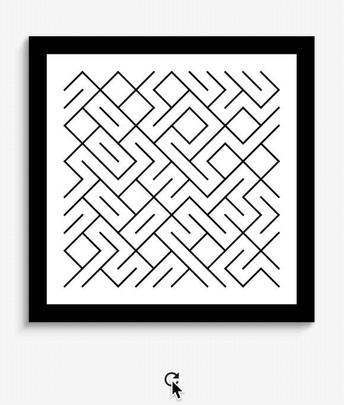

# Flutter Generative Artistry

[generative-artistry](https://github.com/tholman/generative-artistry/) implement in flutter.

1.  Tiled Lines

[Code](https://github.com/xrr2016/flutter-generative-artistry/blob/master/lib/graphs/tiled_lines.dart)

4.  Triangular mesh

[Code](https://github.com/xrr2016/flutter-generative-artistry/blob/master/lib/graphs/triangular_mesh.dart)
